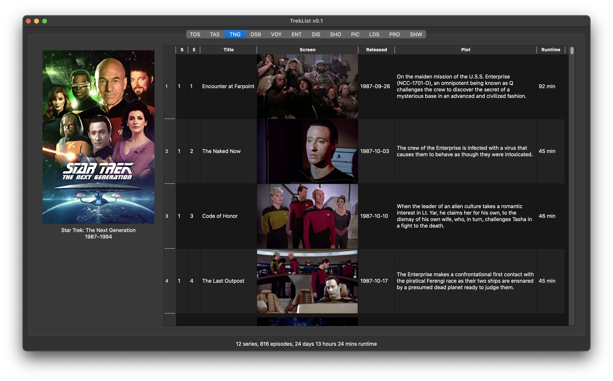

TrekList is an application that expands on what I had already made for my Trekkie self: a Star Trek episode tracker written in Excel. But this is a standalone, automated, self-updating version with lots of (planned) added features and capabilities. I am writing this for ME. But you can use it too, if you like! :vulcan_salute:

## Use

Due to certificate signing issues, it may be necessary for you to disable Gatekeeper. To do this, run `sudo spctl --master-disable` in a terminal. Alternatively, you can also just enable this single app by running `xattr -cr treklist.app`.

## Development

You will need to [generate an OMDb API key](https://www.omdbapi.com/apikey.aspx). Place the key in a text file called `api_key` in the repo's base directory. TrekList is built with python 3.9 and sqlite.

To populate the database, execute the `build_db.ipynb` notebook. It will request all information from OMDb, then pull all posters and insert them into the primary sql database.

## Legal

TrekList is in *no way* affiliated with Star Trek, CBS, or Paramount.

All textual content is courtesy of [omdb](https://www.omdbapi.com), which is licensed under [CC BY-NC 4.0](https://creativecommons.org/licenses/by-nc/4.0/).

[Vulcan salute icon](https://iconduck.com/sets/noto-emoji-by-google) is licensed under the [Apache license 2.0](https://www.apache.org/licenses/LICENSE-2.0) by Google.