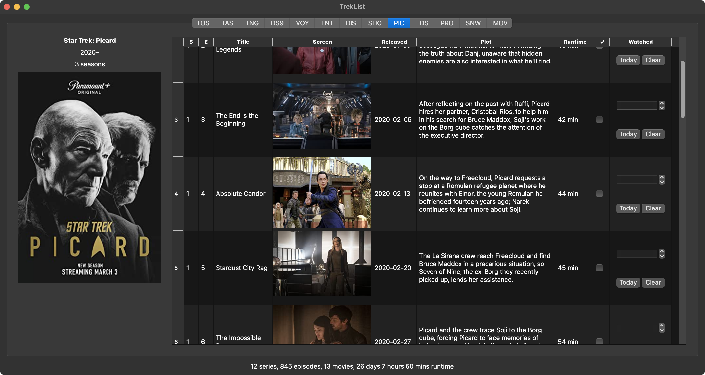

TrekList is an application to maintain an offline record of your Star Trek viewing experience. It is written in Python, uses SQLlite for its database, and OMDb to populate new episodes.

## Development

You will need to [generate an OMDb API key](https://www.omdbapi.com/apikey.aspx). Place the key in a text file called `api_key` in the repo's base directory. 

To build the database, execute the `build_db.ipynb' notebook.

TrekList is in no way affiliated with Star Trek, CBS, or Paramount.